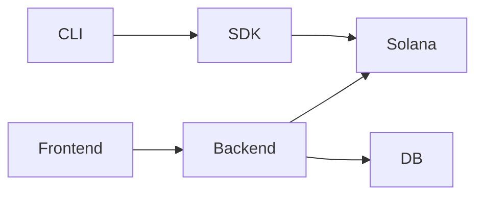
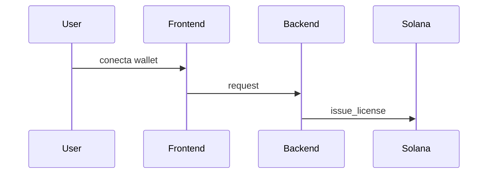
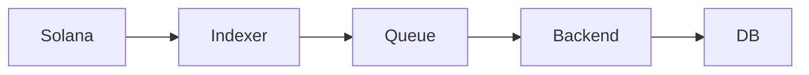

# 🎤 Solana License System

## From Smart Contracts to Real Products

---

# 🧩 Slide 1 — El Problema

La mayoría de proyectos en blockchain:

* son demos simples
* no resuelven problemas reales
* no escalan a productos

👉 Falta algo clave:

> **Arquitectura completa**

---

# 💡 Slide 2 — La Idea

Construir un sistema real de licencias:

* gestión de accesos a software
* validación confiable
* modelo escalable

---

# 🎯 Slide 3 — Objetivo

Crear un sistema que combine:

* Web3 (verificación)
* Web2 (experiencia y escalabilidad)

---

# 🧠 Slide 4 — Insight Clave

> No todo debe estar en blockchain

---

# ⚖️ Slide 5 — Problema de Smart Contracts

* caros
* inmutables
* difíciles de evolucionar

---

# 🧱 Slide 6 — Solución

Arquitectura híbrida:

* Solana → fuente de verdad
* Backend → lógica
* SDK → integración

---

# 🏗️ Slide 7 — Arquitectura General

---

# 🧩 Slide 8 — Componentes

* 🟣 Anchor Program
* 🔵 SDK Rust
* 🟢 Backend
* 🟡 CLI / TUI
* 🟠 Frontend

---

# 🔐 Slide 9 — Modelo de Licencia

Minimalista:

* owner
* product_id
* expires_at
* is_revoked

👉 Nada más.

---

# 💥 Slide 10 — Decisión Importante

❌ No guardar planes en blockchain
✅ Usar solo tiempo (`expires_at`)

---

# 🔄 Slide 11 — Flujo de Compra

---

# 🧠 Slide 12 — Insight

> El usuario NO necesita firmar todo

---

# 🧑‍💻 Slide 13 — Admin Experience

TUI como herramienta principal:

* emitir licencias
* extender
* revocar
* cambiar wallet

---

# 🔥 Slide 14 — SDK Rust

Unifica todo:

* CLI
* backend
* lógica

👉 evita duplicación

---

# ⚡ Slide 15 — Event-Driven

---

# 🔔 Slide 16 — Webhooks

Permiten:

* integraciones externas
* automatización
* notificaciones

---

# 🧠 Slide 17 — Validación

Modelo híbrido:

* offline (rápido)
* online (seguro)

---

# 🧩 Slide 18 — C4 Thinking

* Context → sistema completo
* Container → servicios
* Component → lógica interna

---

# 🚀 Slide 19 — Escalabilidad

El sistema soporta:

* múltiples productos
* múltiples usuarios
* integraciones externas

---

# 💡 Slide 20 — Diferenciador

Esto NO es:

❌ un smart contract demo

Esto ES:

✅ un sistema listo para evolucionar a SaaS

---

# 🧭 Slide 21 — Qué demuestra

* arquitectura de software
* pensamiento de producto
* integración Web2 + Web3
* diseño escalable

---

# 🔥 Slide 22 — Aprendizaje Clave

> Blockchain no reemplaza arquitectura
> La complementa

---

# 💥 Slide 23 — Futuro

* licencias firmadas offline
* dashboard web
* pagos integrados
* multi-product SaaS

---

# 🙌 Slide 24 — Cierre

> Pasar de “hacer smart contracts”
> a “construir sistemas reales”

---
